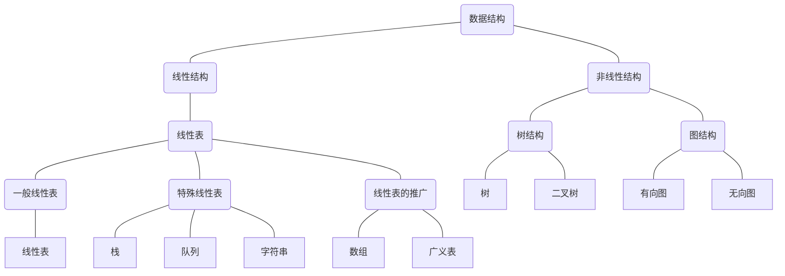

[TOC]

算法：处理问题的策略
数据结构：问题的数学模型

## 基本概念
1. 数据：所有能输入到计算机，且能被计算机处理的符号的集合
2. 数据元素：数据中的基本单位，在计算机中通常作为一个整体进行考虑和处理
3. 数据项：是组成数据元素的、又独立含义的、不可分割的最小单位
4. 数据对象：是性质相同的数据元素的集合
5. 数据结构：相互之间存在一种或多种特定关系的数据元素的集合

### 数据的逻辑结构
* 线性结构
* 树形结构
* 图状结构
* 集合结构

### 数据的存储结构
* 顺序存储：以存储位置的相邻表示后继关系
* 链式存储：以附加信息表示后继关系

### 链式存储的分类
根据链表结点所含指针个数、指针指向和指针连接方式可以分为：
* 单链表
* 循环链表
* 双向链表
* 二叉链表
* 十字链表
* 邻接表
* 邻接多重表

### 数据类型
>数据类型是指一组性质相同的值的集合及定义在此集合上的操作

数据类型可以分为两类：
1. 原子类型：不可以在分解的基本类型
2. 结构类型：有若干个类型组合而成，是可以在分解的

### 抽象数据类型
> 是指一个数学模型以及定义在此数学模型上的一组操作
> 数据抽象：强调的是它的本质特征以及可以使用的外部接口
> 数据封装：隐藏实现细节

## 算法和算法的衡量
> 算法是解决特定问题求解步骤的描述，在计算机中表现为指令的有限序列，并且每条指令表示一个或多个操作

### 算法的特征：
1. 有穷性：能够在有穷步后结束，且每一步都能在有穷时间能完成（还要合理）
2. 确定性：每种情况下都能得到合理的值
3. 可行性：每一步操作足够基本
4. 有输入：必须要加工的对象
5. 有输出：能够得到信息加工得到的结果

### 算法的设计原则
1. 正确性：满则规格和需求
	1. 算法程序不能有语法错误
	2. 算法程序对于合法输入能够产生满足要求的输出
	3. 算法程序对于非法输入能够产生满则规格的说明
	4. 算法对故意刁难的测试输入都有满则要求的输出结果
2. 可读性：易于他人的理解
3. 健壮性：能够合理的处理非法数据
4. 算法的效率和低存储需求

### 算法的衡量和准则
影响算法执行时间的因素
1. 算法选用的策略
2. 问题的规模
3. 编写程序的语言
4. 编译程序产生的机器代码的质量
5. 计算机执行指令的速度
....

主要考虑：算法的策略和规模
#### 算法的时间复杂度
主要关心的是：随着问题规模n的增长，算法时间f(n)的增长关系,记作: $$T(n) = O(f(n))$$
算法 = 控制结构 + 原操作(固有数据类型的操作)
算法执行的时间 = $$\sum$$原操作(i)的执行次数 x 原操作(i)的执行时间
所以算法执行的时间与原操作的执行次数成正比关系

##### 推导大O阶方法
1. 用常熟1取代运行时间中的所有加法常数
2. 在修改后的运算次数函数中，只保留最高阶项
3. 如果最高阶项存在且系数不是1，则去除系数
4. 得到最后的结果就是大O阶

##### 常见的大O阶

常数阶：$$O(1)$$
线性阶：$$O(n)$$
平方阶：$$O(n^2)$$
对数阶：$$O(log_xn)$$
指数阶：$$O(2^n)$$

#### 算法的空间复杂度
算法的存储量包括：
1. 输入数据所占空间
2. 程序本身所占空间
3. 辅助变量所占空间

若输入数据所占空间只取决于问题本身，和算法无关，则只需分析出输入和程序之外的**辅助变量所占额外空间**

若所需额外空间相对于输入数据量来说是常数，则称算法为**原地工作**

随着问题规模n的增大，算法运行所需存储量的增长情况，记作：
$$T(n) = O(g(n))$$